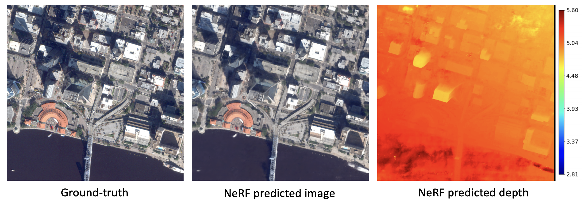

# SatelliteNeRF

PyTorch-based Neural Radiance Fields adapted to satellite domain. This is one of the downstream applications of the [SatelliteSfM](https://github.com/Kai-46/SatelliteSfM) package. 

```bash
# training
python run_nerf.py --config configs/JAX_167.txt
# testing
python nerf_render_image.py --config configs/JAX_167.txt
# extracting mesh
python nerf_extract_mesh.py --config configs/JAX_167.txt
```


